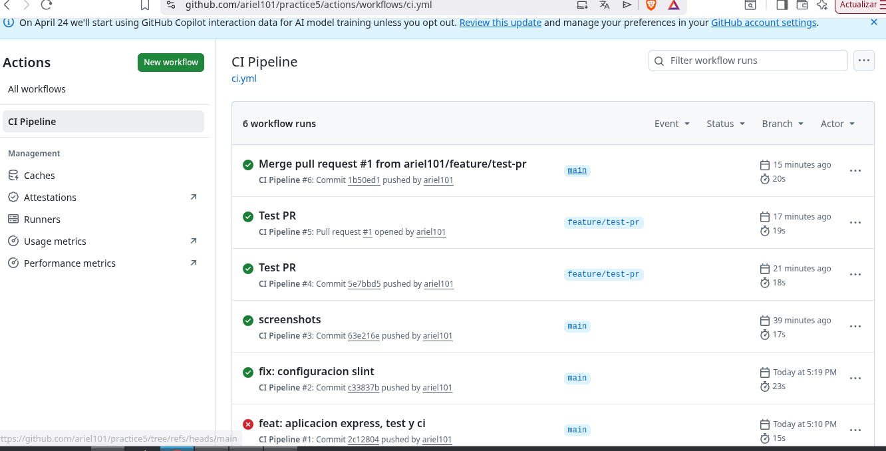
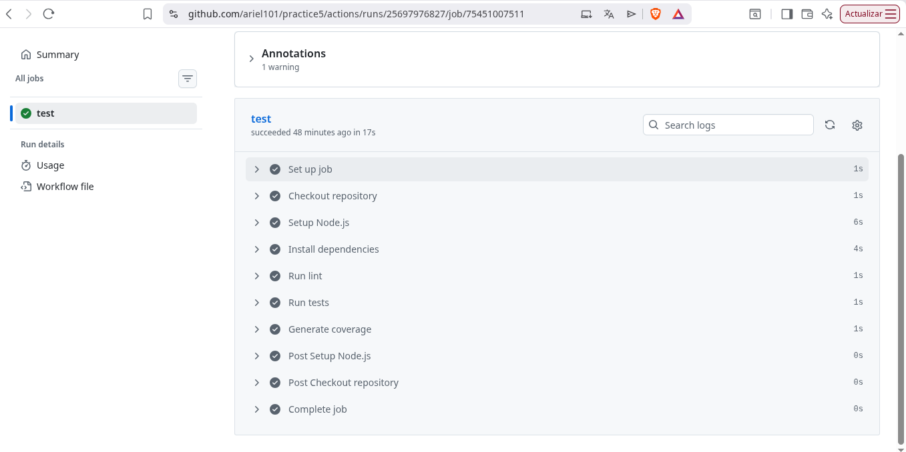
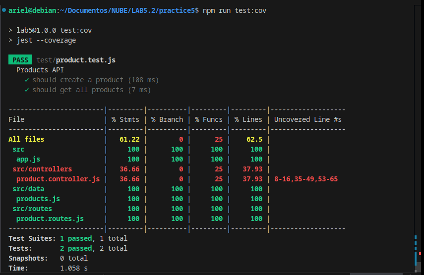
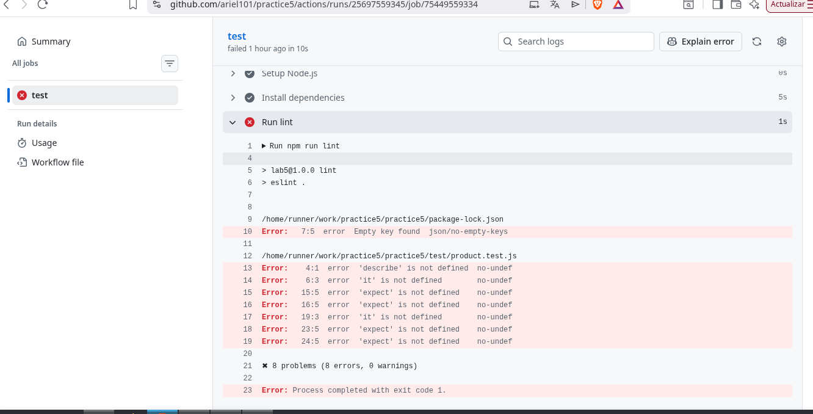
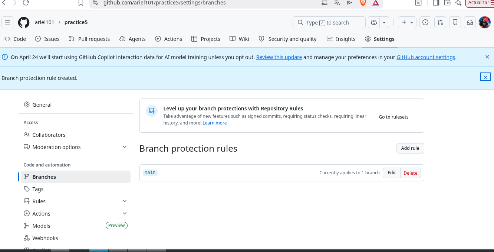
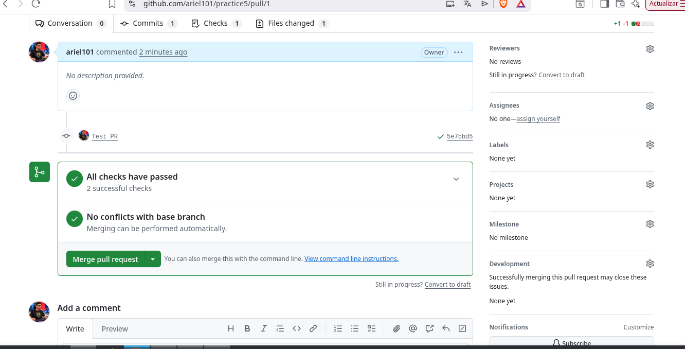
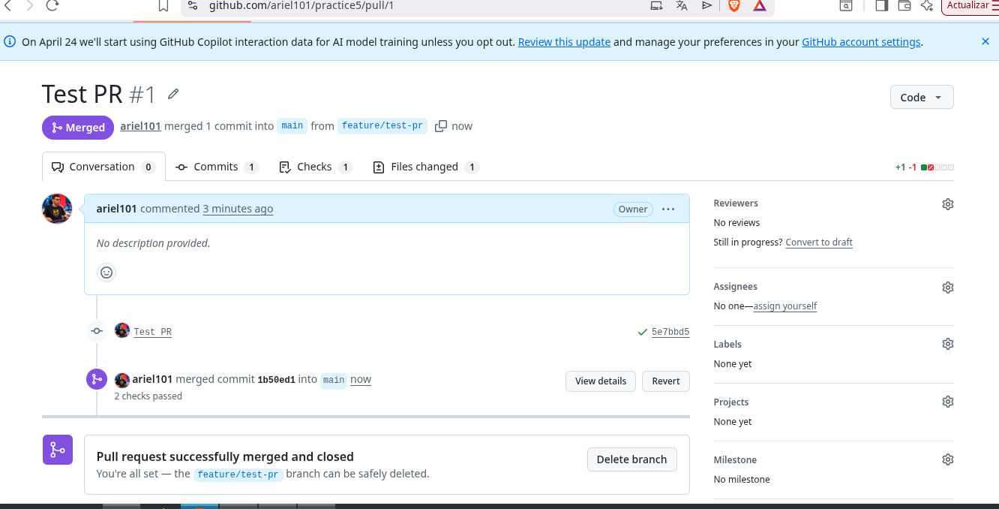
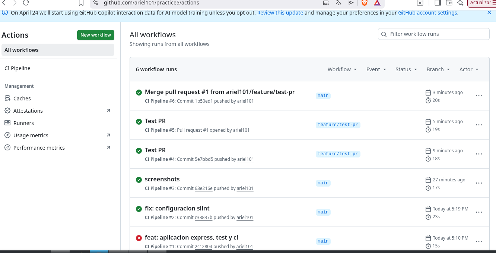

# INFORME DEL LABORATORIO – INTEGRACIÓN CONTINUA CON GITHUB ACTIONS

## Datos del Proyecto

* Proyecto: API CRUD de Productos
* Framework: Express.js
* Lenguaje: JavaScript
* Testing: Jest + Supertest
* CI: GitHub Actions
* Repositorio: COLOCAR_LINK_DEL_REPOSITORIO

---

# 1. Descripción del Proyecto

El proyecto consiste en una API REST desarrollada con Express.js que implementa operaciones CRUD para la entidad Product.

La aplicación permite:

* Crear productos
* Obtener todos los productos
* Obtener un producto por ID
* Actualizar productos
* Eliminar productos

La información se almacena temporalmente en memoria mediante un arreglo de objetos JavaScript.

Además, el proyecto incorpora pruebas automáticas y un pipeline de Integración Continua (CI) usando GitHub Actions.

---

# 2. Tecnologías Utilizadas

| Tecnología     | Descripción                 |
| -------------- | --------------------------- |
| Node.js        | Entorno de ejecución        |
| Express.js     | Framework backend           |
| Jest           | Framework de testing        |
| Supertest      | Testing de endpoints HTTP   |
| ESLint         | Análisis estático de código |
| GitHub Actions | Pipeline CI                 |

---

# 3. Estructura del Proyecto

```text
express-ci-lab/
│
├── src/
│   ├── app.js
│   ├── server.js
│   ├── controllers/
│   ├── routes/
│   └── data/
│
├── tests/
│
├── .github/
│   └── workflows/
│       └── ci.yml
│
├── README.md
├── INFORME.md
└── package.json
```

---

# 4. Configuración del Pipeline CI

Se configuró un workflow utilizando GitHub Actions mediante el archivo:

```text
.github/workflows/ci.yml
```

El pipeline se ejecuta automáticamente cuando:

* Se realiza un push al repositorio
* Se crea una Pull Request hacia main

---

## 4.1 Etapas del Pipeline

### Checkout del código

Descarga automáticamente el repositorio dentro del entorno de GitHub Actions.

```yaml
- uses: actions/checkout@v4
```

---

### Configuración de Node.js

Instala Node.js versión 20 para ejecutar el proyecto.

```yaml
- uses: actions/setup-node@v4
```

---

### Instalación de dependencias

Instala automáticamente las dependencias del proyecto.

```yaml
run: npm install
```

---

### Linting

Ejecuta ESLint para detectar errores de código y malas prácticas.

```yaml
run: npm run lint
```

---

### Ejecución de pruebas

Ejecuta pruebas unitarias e integrales usando Jest y Supertest.

```yaml
run: npm test
```

---

### Generación de cobertura

Genera el reporte de cobertura de pruebas.

```yaml
run: npm run test:cov
```

---

# 5. Workflow Configurado

```yaml
name: CI Pipeline

on:
  push:
    branches:
      - main
      - feature/*
  pull_request:
    branches:
      - main

jobs:
  test:
    runs-on: ubuntu-latest

    steps:
      - name: Checkout repository
        uses: actions/checkout@v4

      - name: Setup Node.js
        uses: actions/setup-node@v4
        with:
          node-version: 20

      - name: Install dependencies
        run: npm install

      - name: Run lint
        run: npm run lint

      - name: Run tests
        run: npm test

      - name: Generate coverage
        run: npm run test:cov
```

---

# 6. Evidencias

## 6.1 Historial de Ejecuciones en Actions

Descripción:

En esta sección se debe mostrar el historial de ejecuciones automáticas del workflow en GitHub Actions después de realizar pushes o Pull Requests.

### Captura de Pantalla




---

## 6.2 Workflow Exitoso

Descripción:

Se evidencia la ejecución exitosa del pipeline CI mostrando todas las etapas completadas correctamente.

### Captura de Pantalla




---

## 6.3 Cobertura de Pruebas

Descripción:

Se muestra el reporte de cobertura generado por Jest indicando el porcentaje de líneas, funciones y ramas cubiertas por las pruebas.

### Captura de Pantalla




---

## 6.4 Workflow Fallido

Descripción:

Se provocó intencionalmente un error en los tests para verificar que GitHub Actions detecte el fallo y marque el workflow como fallido.

### Captura de Pantalla




---

## 6.5 Configuración de Protección de Rama

Descripción:

Se configuró una regla de protección para la rama main habilitando la opción:

* Require status checks to pass before merging

Esto obliga a que el pipeline CI se ejecute correctamente antes de permitir merges.

### Captura de Pantalla




---

## 6.6 Pull Request y Validación Automática

Descripción:

Se creó una Pull Request desde una rama feature hacia main para comprobar que GitHub ejecuta automáticamente el pipeline CI y bloquea temporalmente el merge mientras los checks están pendientes.

### Captura de Pantalla






---

# 7. Resultados Obtenidos

Se logró implementar correctamente:

* API CRUD funcional
* Testing automatizado
* Integración Continua con GitHub Actions
* Validación automática mediante linting
* Cobertura de pruebas
* Protección de rama main
* Validación automática en Pull Requests

---

# 8. Conclusiones

La Integración Continua permite automatizar la validación del proyecto antes de integrar nuevos cambios al repositorio principal.

GitHub Actions facilita la ejecución automática de pruebas, análisis estático y generación de cobertura, ayudando a detectar errores tempranamente.

La protección de ramas mejora la calidad del código y evita que cambios con errores sean fusionados en la rama principal.

El uso de CI en proyectos reales mejora significativamente la confiabilidad, mantenibilidad y calidad del software.
